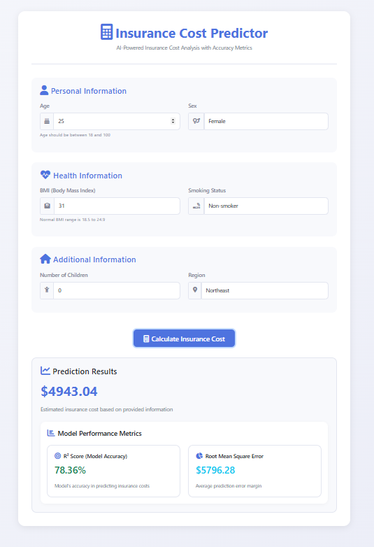

# Machine Learning with Python - Linear Regression Model

This project demonstrates the use of a linear regression model to predict insurance charges based on various features such as age, smoking status, etc. The model is built using Python and several popular libraries including Flask, NumPy, and scikit-learn.

## Table of Contents
- [Installation](#installation)
- [Usage](#usage)
- [Project Structure](#project-structure)
- [License](#license)





## Installation

1. Clone the repository:
    ```bash
    git clone https://github.com/Maria26122/Insurance-cost-predictor-LR-Model-.git
    cd Insurance-cost-predictor-LR-Model-
    ```

2. Create a virtual environment and activate it:
    ```bash
    python -m venv venv
    source venv/bin/activate  # On Windows use `venv\Scripts\activate`
    ```

3. Install the required packages:
    ```bash
    pip install -r requirements.txt
    ```

## Usage

1. Ensure the linear regression model file `linear_regression_model_multiple.joblib` is in the correct directory.

2. Run the Flask application:
    ```bash
    python app.py
    ```

3. Open your web browser and navigate to `http://127.0.0.1:5000` to access the application.

## Project Structure

```
Insurance-cost-predictor-LR-Model-/
├── app.py                 # Main Flask application file
├── templates/            # HTML templates
│   └── index.html       # Main page template
├── .gitignore           # Git ignore file
├── LICENSE              # License file
└── README.md            # Project documentation
```

## License

This project is licensed under the MIT License - see the [LICENSE](LICENSE) file for details.

